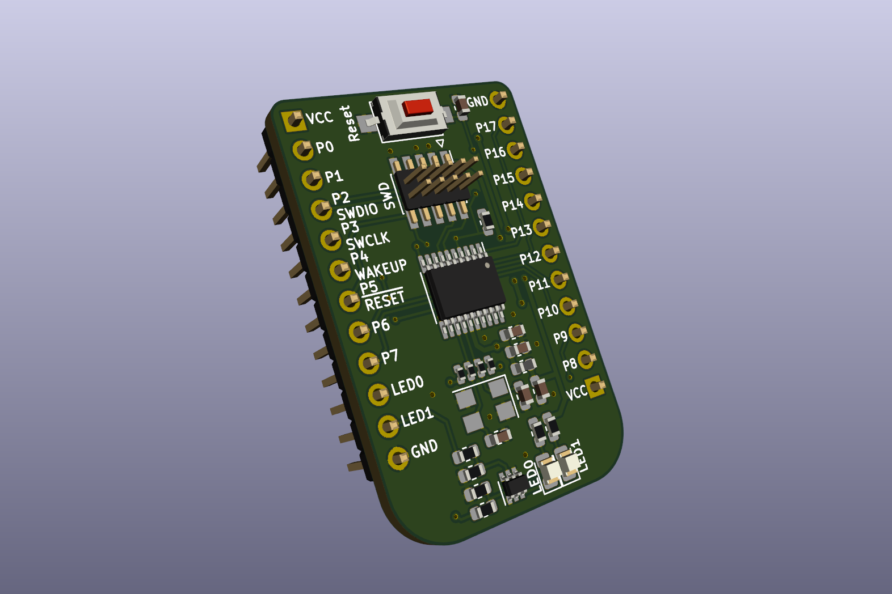

# LPC812 Breakout Board (Rev. A)

Small breakout board designed for the [LPC812](https://www.nxp.com/docs/en/data-sheet/LPC81XM.pdf) ARM Cortex-M0+ microcontrollers from NXP

## Features

- minimal subset of components, no power regulation etc.
- optional external crystal - if not used, its GPIO pins can be connected to the user header by soldering relevant 0R resistors (see schematic)
- two buffered user LEDs, connected to the header - no reserved GPIOs
- reset button
- standard 0.05" pitch SWD programming header, SWD signals also present on the pin headers

Designed in KiCad 5.1.6

Schematic: [PDF](docs/lpc812-breakout.pdf)

License: [CC BY-SA 4.0](https://creativecommons.org/licenses/by-sa/4.0/)
